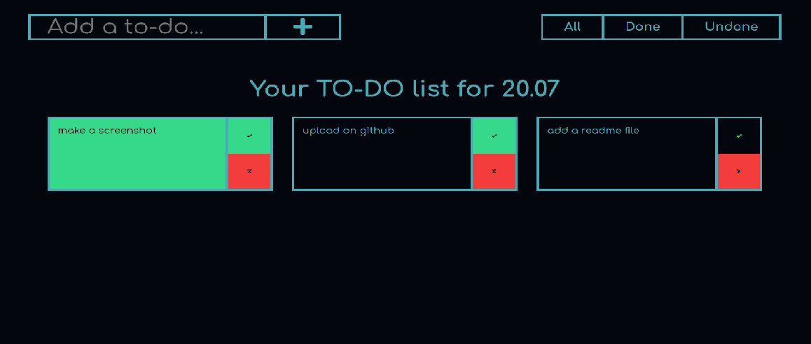

# ToDo List
____

### This is simple todo app maked with HTML, CSS, JS and Webpack
____

____
# Installation and running
____
- Clone this repo to your local machine using git@github.com:Jezitis/ToDo-app.git
- Open folder in your comand line
- In command line type `npm start` to start a local server
    or `npm run build`, go to `build` directory and open `index.html`
____
# Features
____
- Add/Remove ToDo items
- Done/Undone status toggle
- Your ToDos saving to the localstorage